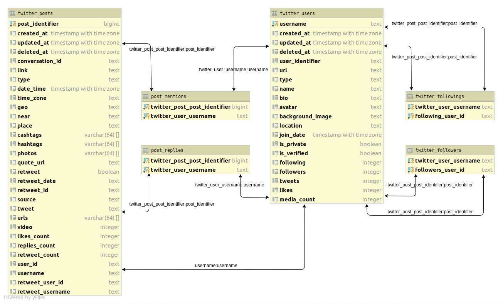

# postgres database
We are using postgres as the store for the raw scraped data from the various data sources. <br>
The schemas are quite similar to the scraped data structures.

<!-- TODO
* https://stackoverflow.com/questions/369266/how-to-document-a-database
* https://stackoverflow.com/questions/186392/how-do-you-document-your-database-structure
* https://app.code.berlin/modules/ck0o5bsnr0922nz72x921o5wb
* Loadtest database!!!
* What are the challenges of our database?
  * read/ write speed ?
* Go deeper in debezium?
  * We do not affect actual database by using database?
* How much inserts can the database handle per sec/ min
* What are the current numbers for our database
* Long running queries
  * How would you realize queries on the whole table?
  * How do you handle time-outs?
-->

## Table of Contents
- [Table of Contents](#table-of-contents)
- [Pipeline overview](#pipeline-overview)
- [Instagram](#instagram)
  - [Table design](#table-design)
    - [Indexes](#indexes)
    - [Constraints](#constraints)
  - [Getting started](#getting-started)
    - [Requirements](#requirements)
    - [Steps](#steps)
- [Twitter](#twitter)
  - [Table design](#table-design-1)
    - [Indexes](#indexes-1)
    - [Constraints](#constraints-1)
    - [ORM usage (gorm)](#orm-usage-gorm)
  - [Getting started](#getting-started-1)
    - [Requirements](#requirements-1)
    - [Steps](#steps-1)
- [Debezium](#debezium)
  - [How](#how)
  - [Why](#why)
- [Deployment](#deployment)
  - [Security](#security)
  - [Fault resistance](#fault-resistance)
    - [Restriction](#restriction)
    - [Backups](#backups)
    - [Replication](#replication)

## Pipeline overview

<!--
* Scraper, Inserter, Postgres, Kafka, S3 and API
-->

## Instagram
This database is the more sophisticated one, since it is running in production since quite some time.


### Table design

#### Indexes

#### Constraints

### Getting started

#### Requirements

#### Steps

## Twitter
This database is not in production yet and at the moment only dumps the tweaked scraped data.



### Table design

#### Indexes

#### Constraints

#### ORM usage (gorm)

### Getting started

#### Requirements

#### Steps

## Debezium
The debezium connector generates a change stream from all the changes in postgres

To read from this stream you can

- get [`kt`](https://github.com/fgeller/kt)
- inspect the topic list in kafka:
  ```bash
  kt topic
  ```
  - all topic starting with `postgres.*` are streams from individual tables
- consume a topic with, for example `kt consume --topic postgres.public.users`

The messages are quite verbose, since they include their own schema description. The most interesting part is the `value.payload` -> `kt consume --topic postgres.public.users | jq '.value | fromjson | .payload'`

### How

### Why

## Deployment
The instagram database is a mangaged postgres running on aws.

### Security
<!-- 
* did we delete all guest accounts
* what roles do we have?
-->

### Fault resistance

#### Restriction
* on queries --> they could bring down the 

#### Backups
We have that :)

#### Replication
